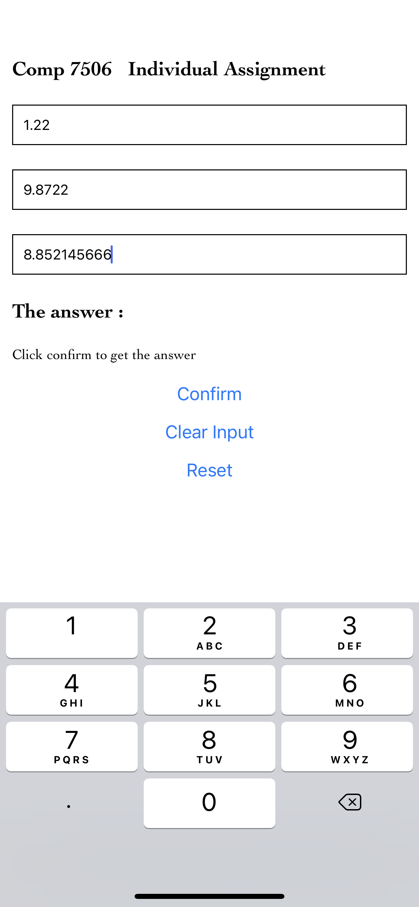
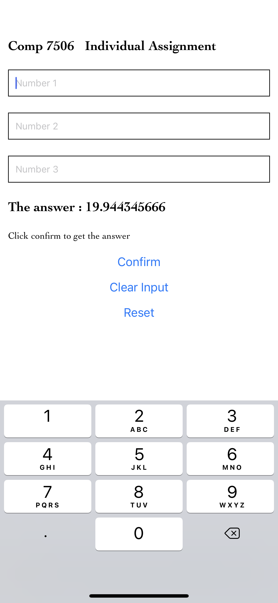
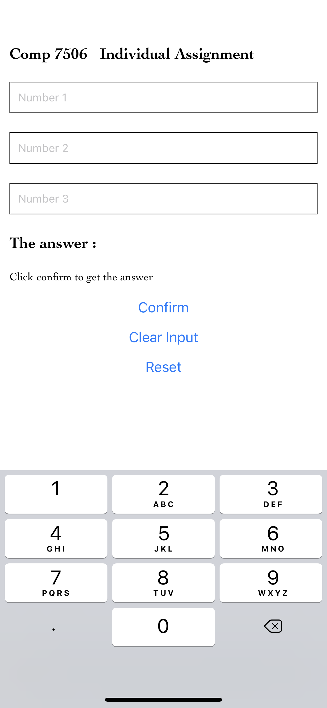

# comp7506 Individual Assignment

## this project create with expo with react-native,

there 3 input field for input any numnber
click comfirm to get thhe Answer
click clear to clear the input and 
click reset to reset all number

